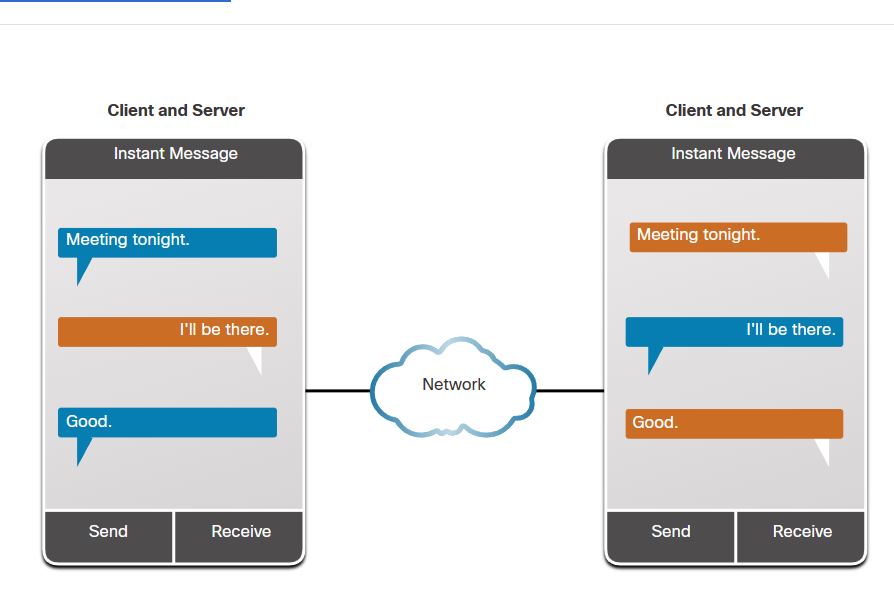

# Apuntes módulo 1

 ## ¿Quién es dueño de internet?
 El internet no es poseida por ningún individuo o grupo. El internet es una colección de redes conectadas con otras redes con el fin de compartir información bajo ciertos estándares. A través de cables, transmisiones inalámbricas y demás, los usuarios de internet pueden intercambiar información.

 ---

 ## Redes locales
 Las redes locales pueden ser de distintos tamaños, desde una red con dos computadores hasta redes que conectan cientos de miles de dispositivos.

 Las redes de negocios y *SOHO* (Small Office/Home Office) generalmente proveen una conexión compartida a internet
 
 ## Tipos de red
 - **Pequeñas redes domésticas:**
 
    Este tipo de red conecta unos pocos dispositivos entre ellos y al internet.
 - **Redes SOHO (Small Office/Home Office):**
   
   Permite a los dispositivos en una oficina o una oficina remota conectarse a una red corporativa o acceso centralizado con recursos compartidos.

- **De redes medianas a redes grandes:**

   Estas redes medianas a grandes como por ejemplo la red de una pequeña corporación o colegio pueden tener muchas locaciones con cientos o miles de hosts interconectados.

- **Redes mundiales**

   Internet es una red de redes que conecta cientos de millones de computadoras en todo el mundo.

---

## Transmisión de infomación

### Tipos de datos personales

- **Datos voluntarios**: son creados y compartidos explícitamente por individuos, como perfiles de redes sociales. Este tipo de datos puede incluir archivos de vídeo, imágenes, texto o archivos de audio.

- **Datos observados:** se capturan registrando las acciones de las personas, como los datos de ubicación cuando usan teléfonos celulares.

- **Datos inferidos:** se trata de datos recolectados discretamente que se basan en el análisis de datos voluntarios u observados. Por ejemplo cuando se usa una tarjeta de crédito, cierta información como la ubicación del usuario puede ser inferida a través del último movimiento hecho con la tarjeta.

### Formas comunes de transmisión de datos

- **Señales eléctricas:** La transmisión se logra representando los datos como pulsos eléctricos en un cable de cobre.
- **Señales ópticas:** La transmisión se logra convirtiendo las señales eléctricas en pulsos de luz.
-  **Señales inalámbricas:** La transmisión se logra mediante el uso de ondas infrarrojas, microondas o radio a través del aire.

---

## Ancho de banda (bandwidth) y throughput 

### Ancho de banda
El ancho de banda es la capacidad de un medio para transportar datos. El ancho de banda digital mide la cantidad de datos que pueden fluir de un lugar a otro en un período de tiempo determinado. El ancho de banda generalmente se mide en la cantidad de bits que (teóricamente) se pueden enviar a través de los medios en un segundo. Las medidas de ancho de banda comunes son las siguientes:

- Miles de bits por segundo (Kbps)
- Millones de bits por segundo (Mbps)
- Miles de millones de bits por segundo (Gbps)

| Unidad de Ancho de Banda | Abreviatura | Equivalencia                                     |
|--------------------------|--------------|-------------------------------------------------|
| Bits por segundo         | bps          | 1 bps = unidad fundamental de ancho de banda    |
| Kilobits por segundo     | Kbps         | 1 Kbps = 1,000 bps = 10^3 bps                   |
| Megabits por segundo     | Mbps         | 1 Mbps = 1,000,000 bps = 10^6 bps               |
| Gigabits por segundo     | Gbps         | 1 Gbps = 1,000,000,000 bps = 10^9 bps           |
| Terabits por segundo     | Tbps         | 1 Tbps = 1,000,000,000,000 bps = 10^12 bps     |

### Latencia
Latencia es la demora entre el envío desde el emisor y el descifrado por el receptor, esto es principalmente una función del tiempo de viaje de las señales, y el tiempo de procesamiento en los nodos que la información atravies

### Throughput (rendimiento de la tasa de la información transferida)

El throughput, al igual que el ancho de banda, mide la transferencia de bits a través de un medio dentro de un período de tiempo determinado. Sin embargo, no son lo mismo ya que el throughput mide el rendimiento de la información transferida y tiene en cuenta los siguientes factores:

- El volumen y la naturaleza de los datos transmitidos y recibidos.
- El impacto de la latencia introducida por los dispositivos de red encontrados entre el origen y el destino.
- La latencia, que abarca retrasos, significa el tiempo que tardan los datos en viajar de un punto a otro.

Hay pruebas de velocidad en línea disponibles para evaluar el throughput de una conexión a Internet.

---

## Clientes y servidores
Todas las computadoras conectadas a una red que participan directamente en la comunicación de la red se clasifican como hosts. Los hosts pueden enviar y recibir mensajes en la red. En las redes modernas, los hosts de las computadoras pueden actuar como cliente, servidor o ambos.

Por otro lado los servidores son hosts que tienen software instalado que les permite proporcionar información, como correo electrónico o páginas web, a otros hosts de la red. Cada servicio requiere un software de servidor independiente. Por ejemplo, un host requiere un software de servidor web para poder proporcionar servicios web a la red. Cada destino que visita en línea se lo proporciona un servidor ubicado en algún lugar de una red que está conectada a Internet global.

Los clientes son hosts informáticos que tienen instalado un software que les permite solicitar y mostrar la información obtenida del servidor. Un ejemplo de software cliente es un navegador web, como Internet Explorer, Safari, Mozilla Firefox o Chrome.

### Redes peer-to-peer (P2P)
El software de cliente y de servidor generalmente se ejecuta en computadoras separadas, pero también es posible que una computadora ejecute el software de cliente y de servidor al mismo tiempo. En las pequeñas empresas y en los hogares, muchas computadoras funcionan como servidores y clientes de la red. Este tipo de red se denomina red peer-to-peer (P2P).

La red P2P más simple consta de dos computadoras conectadas directamente mediante una conexión por cable o inalámbrica. Luego, ambas computadoras pueden utilizar esta red simple para intercambiar datos y servicios entre sí, actuando como cliente o servidor según sea necesario.

También se pueden conectar varias PC para crear una red P2P más grande, pero esto requiere un dispositivo de red, como un conmutador, para interconectar las computadoras.

La principal desventaja de un entorno P2P es que el rendimiento de un host puede verse ralentizado si actúa como cliente y servidor al mismo tiempo. La figura enumera algunas de las ventajas y desventajas de las redes peer-to-peer.

#### Aplicaciones peer-to-peer
Una aplicación P2P permite que un dispositivo actúe como cliente y servidor dentro de la misma comunicación. En este modelo, cada cliente es un servidor y cada servidor es un cliente. Las aplicaciones P2P requieren que cada dispositivo final proporcione una interfaz de usuario y ejecute un servicio en segundo plano.

