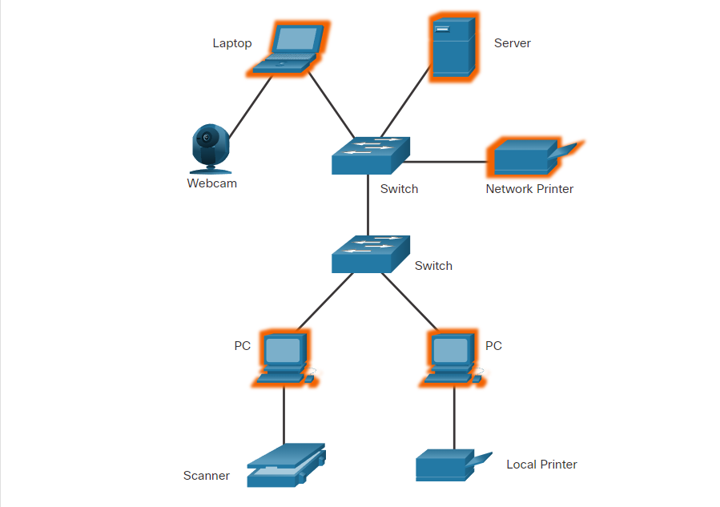
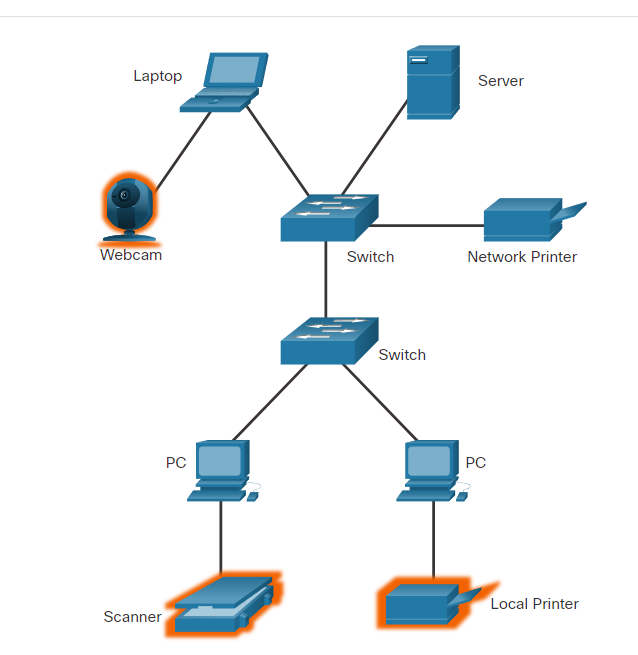
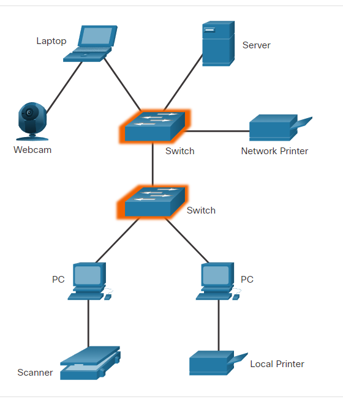
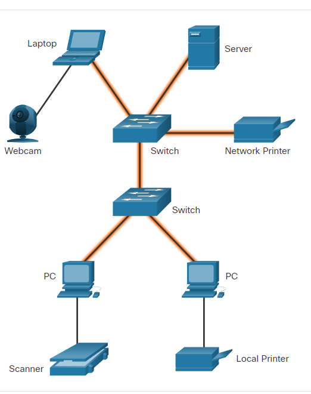
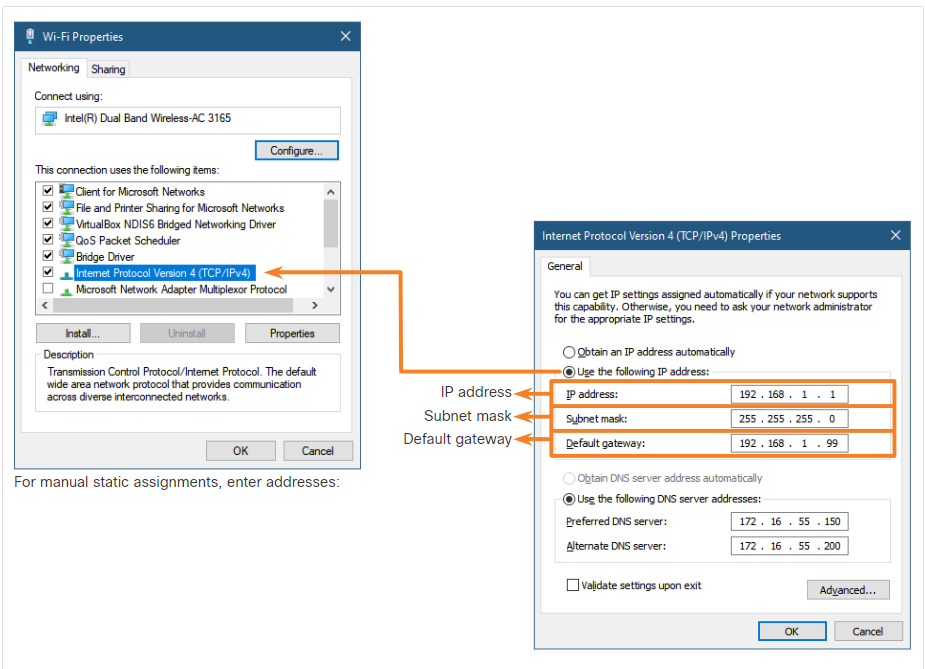
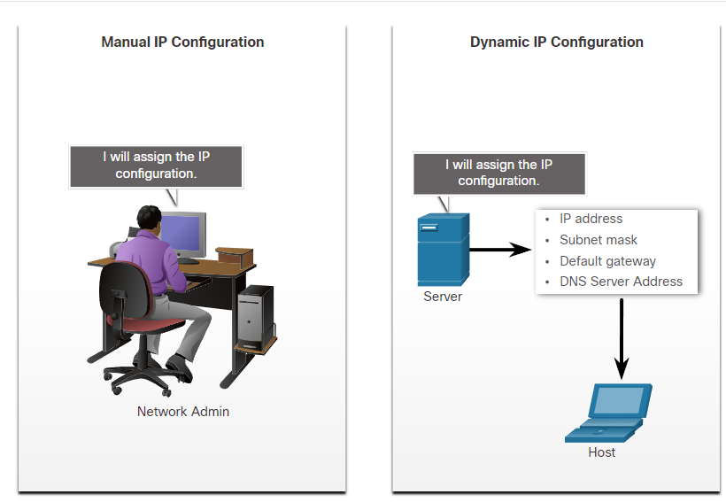

# Apuntes módulo 2

## Conexiones inalámbricas usuales

- **GPS (Global Positioning System):** El GPS utiliza satélites para transmitir señales que cubren todo el mundo. El teléfono inteligente puede recibir estas señales y calcular la ubicación del teléfono con una precisión de 10 metros.

- **WI-FI:** Los transmisores y receptores de Wi-Fi ubicados dentro del teléfono inteligente permiten que el teléfono se conecte a redes locales e Internet. Para recibir y enviar datos en una red Wi-Fi, el teléfono debe estar dentro del alcance de la señal de un punto de acceso a la red inalámbrica. Las redes Wi-Fi suelen ser de propiedad privada, pero a menudo ofrecen puntos de acceso público o para invitados. Un punto de acceso es un área donde las señales de Wi-Fi están disponibles. Las conexiones de red Wi-Fi en el teléfono son similares a las conexiones de red en una computadora portátil.

- **Bluetooth:** Bluetooth es una tecnología inalámbrica de bajo consumo y alcance más corto que pretende reemplazar la conectividad por cable para accesorios como parlantes, auriculares y micrófonos. Dado que la tecnología Bluetooth se puede utilizar para transmitir datos y voz, se puede utilizar para crear pequeñas redes locales. Bluetooth es una tecnología inalámbrica que permite que los dispositivos se comuniquen a distancias cortas. Se pueden conectar varios dispositivos al mismo tiempo con Bluetooth.

- **NFC (Near Field Communications):** Near Field Communication (NFC) es una tecnología de comunicación inalámbrica que permite el intercambio de datos entre dispositivos que se encuentran muy cerca entre sí, normalmente a menos de unos pocos centímetros. Por ejemplo, se puede utilizar NFC para conectar un teléfono inteligente y un sistema de pago. NFC utiliza campos electromagnéticos para transmitir datos.

---

## Conexiones de red local

### Tipos de componentes de red local
- **Hosts:** Los hosts envían y reciben el tráfico de los usuarios. Un host es un nombre genérico para los dispositivos finales (vistos en el módulo 1). Un host poseee una dirección IP. A continuación un ejemplo de hosts:

    

    En la figura se aprecia una impresora actuando como host, recordemos que un host es aquel dispositivo que posee la capacidad de recibir y enviar información a través de la red.
- **Periféricos:** Los dispositivos periféricos no se comunican directamente con la red. En cambio, los periféricos dependen de su host conectado para realizar todas las operaciones de red. Ejemplos de periféricos compartidos son cámaras, escáneres e impresoras conectadas localmente.

    

- **Dispositivos de red:** Los dispositivos de red conectan otros dispositivos, principalmente hosts. Estos dispositivos mueven y controlan el tráfico de la red. Ejemplos de dispositivos de red incluyen concentradores, conmutadores y enrutadores.

    

- **Medios de red:** Los medios de red proporcionan conexiones entre hosts y dispositivos de red. Los medios de red pueden ser cableados, como cobre y fibra óptica, o utilizar tecnologías inalámbricas.

    

---
## Direccionamiento del dispositivo final

Direccionamiento del dispositivo final
Para conectarse físicamente a una red, un dispositivo de usuario final debe tener una tarjeta de interfaz de red (NIC). La NIC es una pieza de hardware que permite que el dispositivo se conecte al medio de red, ya sea por cable o inalámbrico. Puede estar integrado en la placa base del dispositivo o puede ser una tarjeta instalada por separado.

Además de la conexión física, se requiere alguna configuración del sistema operativo para que el dispositivo participe en la red. La mayoría de las redes se conectan a Internet y utilizan Internet para intercambiar información. Un dispositivo de usuario final requiere una dirección de Protocolo de Internet (IP), así como otra información, para identificarlo ante los demás dispositivos de la red. Como se muestra en la figura, existen tres partes en la configuración IP que deben ser correctas para que el dispositivo envíe y reciba información en la red:

- **Dirección IP (IP address):** identifica el host en la red.
- **Máscara de subred (Subnet mask):** se utiliza para identificar la red a la que está conectado el host.
- **Puerta de enlace predeterminada (Default gateway):** identifica el dispositivo de red que utiliza el host para acceder a Internet u otra red remota.

**Nota: La mayoría de las aplicaciones de red utilizan un nombre de dominio, como www.cisco.com, en lugar de una dirección IP al acceder a información en Internet. Se utiliza un servidor DNS para traducir el nombre de dominio a su dirección IP. Sin una dirección IP de un servidor DNS, el usuario tendrá dificultades para acceder a Internet.**

---

## Direccionamiento manual y automático

Una dirección IP puede configurarse manualmente o asignarse automáticamente mediante otro dispositivo, como se muestra en la figura.

- **Configuración IP manual:** Con la configuración manual, los valores requeridos se ingresan en el dispositivo a través del teclado, generalmente por parte de un administrador de red. La dirección IP que se ingresa se conoce como dirección estática y debe ser única en la red.

- **Configuración de IP dinámica:** La mayoría de los dispositivos de usuario final se pueden configurar para recibir información de configuración de red de forma dinámica. Esto permite que el dispositivo solicite una dirección de un grupo de direcciones asignadas por un servidor de Protocolo de configuración dinámica de host (DHCP) ubicado dentro de la red.

